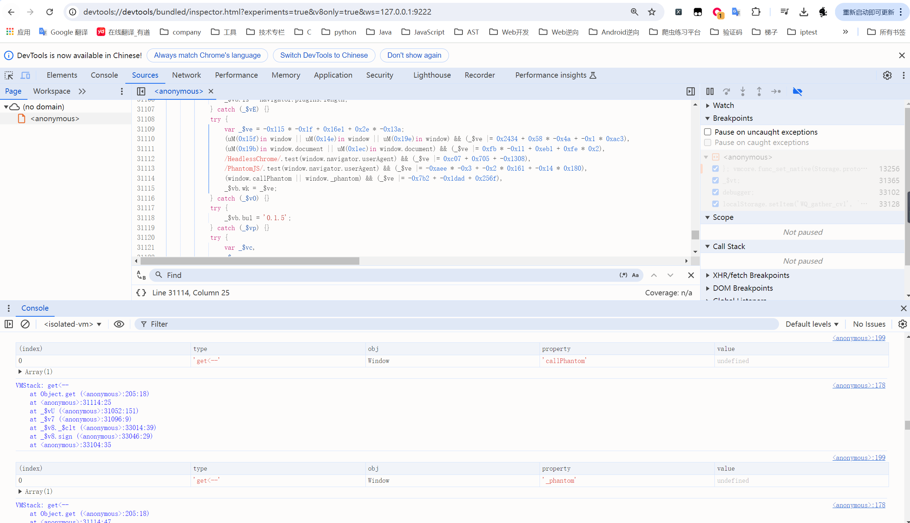
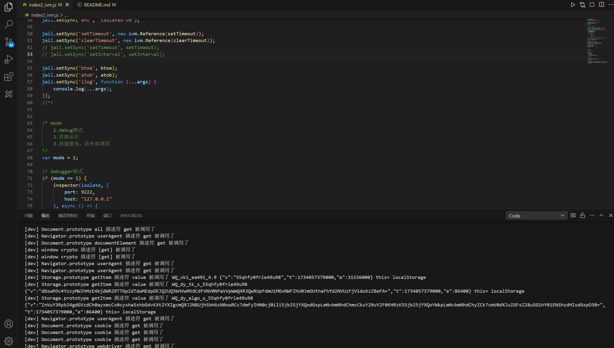

### JS补环境框架，整体架构及执行流程如下:

```javascript
> +框架本身代码
> +1_init.js                 //初始化，如初始化document.cookie，navigator等
> +2_code.js                 //目标网站的js文件
> +3_export_in_vm.js         //对外导出函数，但执行环境是在沙箱中，如向外提供的函数依赖于目标网站
> +4_export_in_node.js       //对外导出函数，但执行环境是在nodejs中，如需要加载一些库
> +5_server.js               //向外提供api服务
```

**执行入口：**</br>

​	index1_vm2.js 使用vm2沙箱  
​	index2_ivm.js 使用isolated-vm沙箱，调试相比vm2更方便快捷


### 监控访问；根据调用栈定位

!(./assets/0.gif)




